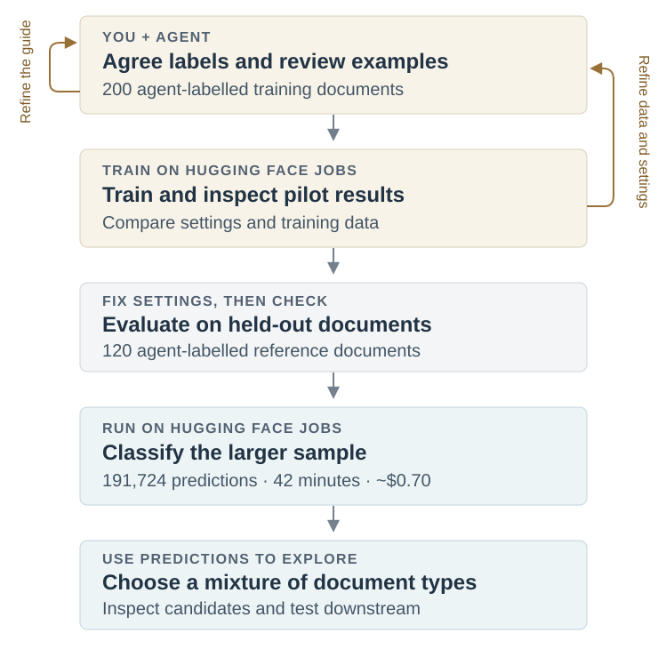
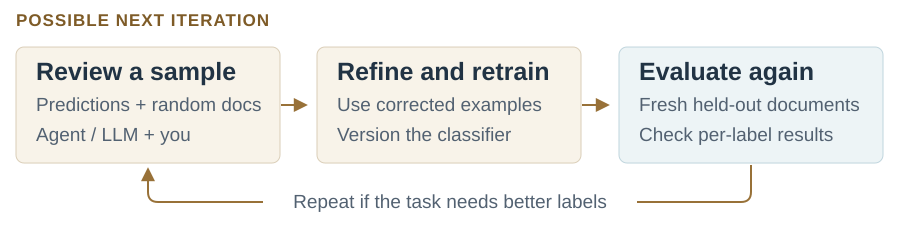
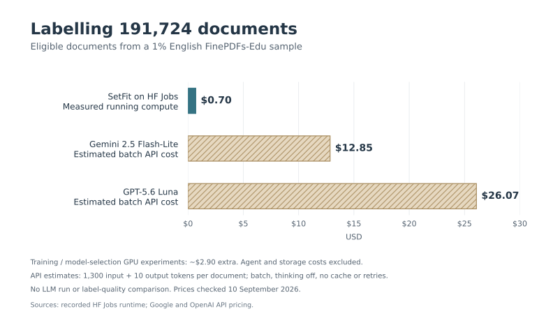

.](card-index.jpg){fig-alt="A hand selecting a card from an index with labelled drawers." width=640}

[FinePDFs-Edu](https://huggingface.co/datasets/HuggingFaceFW/finepdfs-edu) contains text extracted from PDFs and filtered for educational value. It's a subset of [FinePDFs](https://huggingface.co/datasets/HuggingFaceFW/finepdfs), a dataset built from PDFs collected by [Common Crawl](https://huggingface.co/buckets/commoncrawl/commoncrawl). It includes a wide variety of material, from worksheets and reference guides to research papers.

Depending on what we want to train, we might want different mixtures of these documents: material for pretraining, sources for generating supervised fine-tuning examples, or documents for training a retriever. How could we add metadata that makes those choices easier?

Document purpose seemed like one useful dimension. An LLM is a useful starting point for labelling a few examples, especially while the categories are still changing. For a small batch, that may be all we need. At around 23 million English documents, though, repeatedly processing each document and rubric with an LLM adds up.

Training a small classifier gives us a reusable model: we can save and version it, share it, and apply the same classification scheme to new batches. The initial labelling and training work can be spread over many runs. FinePDFs-Edu itself used classifiers trained on LLM-generated annotations for its educational filtering; we could add another dimension using a similar approach.

I wanted to see how far I could get by asking a coding agent to help build one: explore the data, propose categories, create training examples, and train and test a model using [Hugging Face Jobs](https://huggingface.co/docs/hub/jobs-overview).

The workflow involved several rounds of reviewing documents, refining the labels and checking models before running the classifier on a larger sample:

{#fig-workflow fig-alt="An iterative development stage: work with an agent to review labels and examples, and train pilot classifiers on Hugging Face Jobs. Example review refines the guide; pilot errors inform training data and settings. After fixing the settings, evaluate against 120 held-out agent-labelled documents, then run the classifier on Jobs to produce 191,724 predictions. Use those predictions to explore sampling mixtures and test downstream usefulness." width=680}

## What should the labels describe?

After exploring samples with the agent and looking through documents myself, we settled on six categories describing document purpose: instruction/reference, exercise/assessment, administration/policy, research/analysis, news/promotion, and other. A school worksheet and a school policy can be about the same subject while serving different purposes.

The agent sampled documents, proposed a labelling guide and labelled examples. I reviewed the categories and tricky cases before we expanded the training set to **200 agent-labelled documents**. Deciding what belonged in each category took several rounds of discussion.

## Building and checking the classifier

We used [SetFit](https://huggingface.co/docs/setfit/index), a library for training text classifiers from small labelled datasets, with a [149-million-parameter ModernBERT encoder](https://huggingface.co/nomic-ai/modernbert-embed-base). The agent wrote the scripts and ran training and comparisons on Jobs. Long documents were represented by excerpts from their beginning, middle and end.

We compared classifier settings and training-data choices, including whether fine-tuning helped over using the original embeddings. We also repeated training with three random seeds to check how much the results varied.

On 120 held-out, agent-labelled documents, the model we used for the larger run reached **65.8% accuracy and 0.556 macro F1**. Those labels followed the reviewed guide; they aren't independent human ground truth.

The breakdown is useful for deciding how to sample. Precision measures how often a prediction matches the reference label; recall measures how many reference examples of a category the model finds.

::: {.table-responsive}

| Purpose | Reference examples | Precision | Recall |
|---|---:|---:|---:|
| Administration/policy | 24 | 69% | 75% |
| Exercise/assessment | 19 | 74% | 74% |
| Instruction/reference | 41 | 73% | 54% |
| News/promotion | 20 | 55% | 85% |
| Research/analysis | 13 | 57% | 62% |
| Other | 3 | — | 0% |

:::

The model correctly identified a phonics worksheet as exercise/assessment, but classified a handout explaining French grammatical gender as administration/policy. It made no “other” predictions in this evaluation.

Instruction/reference predictions could help find candidates, but the 54% recall means filtering exclusively on that label would miss many examples. I'd retain random samples for coverage and review documents before relying on a category.

We could do another development round: ask an agent or LLM to review fresh predictions alongside random documents, flag disagreements for me to check, and use corrected examples to refine the guide and retrain. A revised model would need a fresh held-out evaluation. This would be a possible next step, not a result of the current experiment.

{#fig-refinement fig-alt="A proposed horizontal refinement loop: an agent or LLM and a person review fresh predictions and random documents; corrected examples inform refinement and retraining; the new model is evaluated on fresh held-out data. Repeat if the task needs better labels." width=800}

## Running it on a larger sample

The agent then wrote an inference script to read source Parquet with DuckDB, prepare excerpts, classify batches and save predictions as Parquet. Jobs ran the script and installed its declared Python dependencies. The core of the Python submission looked like this:

```python
job = api.run_uv_job(
    script="classify.py",
    flavor="a10g-small",
    timeout="2h",
    python="3.12",
    secrets={"HF_TOKEN": token},
    env=run_environment,
)
```

Here, `run_environment` includes the pinned input revision and runtime settings. The [complete inference script](https://huggingface.co/datasets/davanstrien/finepdfs-doctype-experiments-20260908/blob/b6486c0a9b385a2a5c47e03d6e7666a88b319c6a/one-percent-20260909/inputs/classify.py) also handles saving progress and checking inputs.

We sampled **230,234 source rows: 1% of the English subset**. After language and text checks, **191,724 received predictions**; excluded rows were retained with reasons. This sampled row groups across all 100 English files, so it is a clustered sample.

The Job took **42 minutes**, costing approximately **$0.70** in running compute. Training and model-selection GPU experiments added about **$2.90**; agent costs and storage aren't included.

For comparison, labelling the same excerpts with low-cost batch LLM APIs would cost an estimated **$13–26**. Scaling to the **full English FinePDFs-Edu subset** projects to roughly **$70 for classifier inference versus $1,300–2,600 for those APIs**.[^costs] We haven't compared their label quality. Extending to other languages would require additional model and evaluation work.

{#fig-costs fig-alt="Cost to label the 191,724 eligible documents: SetFit on Hugging Face Jobs, $0.70 from measured runtime; Gemini 2.5 Flash-Lite batch API, estimated $12.85; GPT-5.6 Luna batch API, estimated $26.07. Training and model-selection GPU experiments cost about $2.90 separately. Agent and storage costs are excluded. No LLM run or label-quality comparison was performed." width=800}

[Download the chart as PNG](cost-comparison.png) · [SVG](cost-comparison.svg)

## What would I use this for?

The [resulting dataset](https://huggingface.co/datasets/davanstrien/finepdfs-edu-purpose) joins the predictions back to source text. I could use it to build retrieval-training candidates with different proportions of exercises, reference material and research.

Purpose could also be combined with separately developed topic or reading-level labels to find, for example, introductory science explanations. Each additional classifier would have its own compute and validation costs, but the resulting columns would give us more ways to select data for experiments.

Document purpose doesn't establish quality or relevance, and I haven't tested downstream gains. This is a proof of concept for having an agent help turn a curation idea into a cheap, reusable classifier.

For a starting point with your own labelled data, the [SetFit Jobs recipe](https://huggingface.co/datasets/uv-scripts/classification#few-shot-with-setfit-train-setfitpy) includes a reusable [UV training script](https://huggingface.co/datasets/uv-scripts/classification/blob/main/train-setfit.py). You can give the recipe to your agent along with this prompt. Use the copy button to copy the whole prompt:

```{.default #curation-prompt filename="Prompt for your agent"}
Help me build a small classifier for curating this dataset: [dataset URL].

First ask what I want to use the data for, then explore a sample and propose useful categories. Show me examples and ambiguous cases so we can refine the guide together.

Use hf jobs --help to explore the compute options. Consider the SetFit UV recipe as a starting point:
https://huggingface.co/datasets/uv-scripts/classification/blob/main/train-setfit.py

Propose a compute budget, train and evaluate a baseline, and show me its per-category results and mistakes before we decide whether to refine it or scale it. Save the trained model and preprocessing details so we can reuse them.
```

[^costs]: Estimates dated 10 September 2026: Gemini 2.5 Flash-Lite and GPT-5.6 Luna batch prices from [Google](https://ai.google.dev/gemini-api/docs/pricing) and [OpenAI](https://developers.openai.com/api/docs/pricing). Assumes 1,300 input tokens per eligible document, including the rubric, and 10 output tokens; thinking disabled, no caching or retries. These are budget estimates, not measured API runs. Full-English projections assume the same eligibility rate, document lengths and throughput; training is a separate cost.
